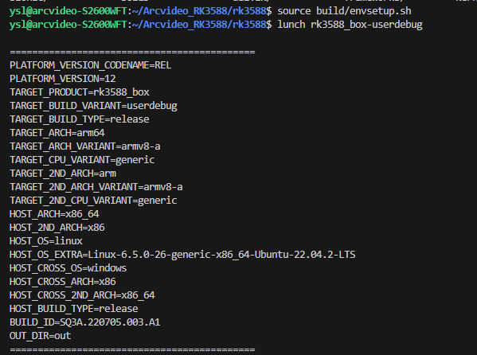
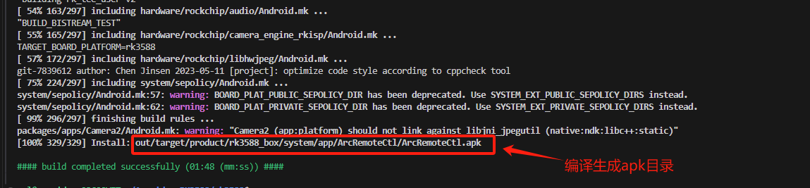

# ArcRemoteCtl 服务组件
## 组件编译说明
### 方式一：手动安装 ArcRemoteCtl 服务组件
```js/java/c#/text/shell
$ source build/envsetup.sh 

// 选择 AOSP 需要编译的产品
$ lunch rk3588_box-userdebug 
```
  
接着就是通过 mmm 指令编译 arcremotectl 工程，将得到对应的 apk 文件。
```js/java/c#/text/shell
$ mmm arcremotectl/
```
  
接着通过取出 apk 文件，然后通过 adb 安装到刷好 __该 AOSP 固件__ 的设备上:
```js/java/c#/text/shell
> adb install ArcRemoteCtl.apk
```
## __注意: ArcRemoteCtl 服务组件首次安装后，需要手动启动一次后，开机广播监听机制才会生效，不然系统重启后服务组件无法自启动，需要通过下面的命令进行设置：__ 
```js/java/c#/text/shell
> adb shell am start com.arcvideo.remotectl/.MainActivity
```
下次系统重启后，ArcRemoteCtl 服务组件便能监听到开机广播并自启。
### 方式二：系统集成 ArcRemoteCtl 服务组件  
首先查看 arcremotectl 工程目录下的 Android.mk 文件
```js/java/c#/text/shell
###############################################################################
# RKTvLauncher
LOCAL_PATH := $(call my-dir)
include $(CLEAR_VARS)

# 当前编译工程名称，如果需要系统集成 ArcRemoteCtl 服务组件，只需要将 "ArcRemoteCtl" 添加到编译文件中
LOCAL_PACKAGE_NAME:= ArcRemoteCtl
LOCAL_MODULE_TAGS := optional
LOCAL_CERTIFICATE := platform
LOCAL_SRC_FILES := $(call all-java-files-under, src)

# ArcRemoteCtl 集成方式，LOCAL_PRIVILEGED_MODULE 设置为 true 的情况下，ArcRemoteCtl 服务组件
# 会被安装到 /syste/priv-app/ 目录下，设置为 false 或默认不配置的情况下，ArcRemoteCtl 服务组件
# 会被安装到 /syste/app/ 目录下
#LOCAL_PRIVILEGED_MODULE := true

LOCAL_PRIVATE_PLATFORM_APIS := true
LOCAL_STATIC_ANDROID_LIBRARIES := \
        androidx.appcompat_appcompat \
        androidx-constraintlayout_constraintlayout

include $(BUILD_PACKAGE)
```
接着将 "ArcRemoteCtl" 添加到编译文件 device/rockchip/rk3588/rk3588_box/rk3588_box.mk :
```js/java/c#/text/shell
PRODUCT_PACKAGES += ArcRemoteCtl
```
最后编译 AOSP Android系统分区，烧录 Sytem.img 或 super.img。系统重启后 ArcRemoteCtl 服务组件能够监听系统开机广播并自启。

## 方式对比
__手动安装__  
不需要编译系统和烧录分区镜像，只需要编译出 apk 文件，安装到 AOSP 固件设备上，中间需要手动重启一次才能实现 ArcRemoteCtl 服务组件监听系统开机广播并自启。  
  
__系统集成__  
需要将 "ArcRemoteCtl" 添加到编译文件，接着编译 AOSP Android系统分区，然后烧录Sytem.img 或 super.img 即可实现功能。  